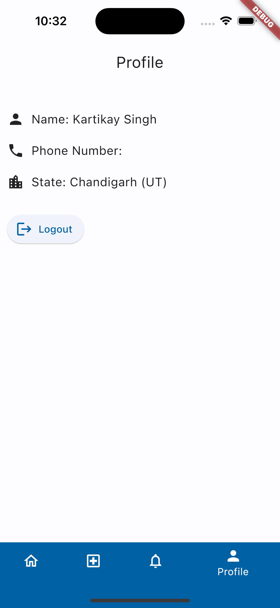

# Mobile App For Veterinarian and Pet Owners
This platform provides an easy and effective way for Veterinarian, Petowners.  
benefit of this app is that Petowners can connect, consult and book appointment to  
their nearby Veterinarian.

## 1. Features

 1. Allow Petowners to see the list of their nearby Veterinarian.
 2. Allow to chat them and makes online consultation very easy.
 3. It also allow Petowners to book an physical appoinment to that vet.
 4. Veterinarian will get requests for the same and accordingly accept or reject the requests.
## 2. User Guide
 ### 2.1 How Download
1. Download the released apk from here.
2. Install it in your android device.
### 2.2 How to build app locally
1. Clone the repository.
2. Open the project in Android Studio.
3. Build the project.
4. Run the app.
## 3. Software Documents
1. [Software Requirement Specification]()
2. High Level Design Document.
3. Low Level Design Document.
4. Test Plan Document.
6. Coding Report #1.

# SRS Document
## Table of Contents
1. Introduction
2. Overall Description
4. Software Stack
5. Features of the App
6. Functional Requirements
7. Non-Functional Requirements
8. Database Requirements
9. Implemetation Details
10. Flow Diagram
11. User Description
12. Work Flow 

# 1. Introduction
The purpose of this document is to describe the overall behavior of our app “VetPet”. this documents defines the requirements for the of the operations, performance and quality assurance. it also defines the functional and non-functional requirements, constraints and assumptions. this document is intended for both the stakeholders and the developers of the system.
## Project Purpose
The purpose of this project is to provide a platform for pet owners and veterinarians to connect with each other. This platform will provide an easy and effective way for pet owners to connect, consult and book appointments to their nearby veterinarians. 

This app will facilitate the owners to:
1. See the list of their nearby veterinarians.
2. Chat with them and make online consultation very easy.
3. Book physical appointments to that vet.
4. See the History of treatments of theirs pets.

This app will facilitate the veterinarians to:
1.  get requests for the same and accordingly accept or reject the requests.
2. see the list of all the appointments they have accepted or rejected.
3. update the history of treatments of the pets they have treated.
## Project Scope
This app will reduce the unnecessary physical visits of the pet owners to the veterinarian for minor concerns. they can do it at their home using the application. and can book appointments according to their suitable time slot. it will reduce unneccesary time wastage in waiting at the office of vets. it will also help the vets to manage their appointments and keep a record of the treatments they have done.
# 2. Overall Description
## Product Perspective
This app will provide a platform for pet owners and veterinarians to connect with each other. This platform will provide an easy and effective way for pet owners to connect, consult and book appointments to their nearby veterinarians.
## Product Features
1. New users will signup and Register themselves using their email and mention their role of using the app (veterinarian and pet owners).
2. Users will be able to login using their email and otp verification.
3. Petowners will be able to see the list of their nearby veterinarians.
4. Petowners will be able to chat with them and make online consultation very easy.
5. Petowners will be able to book physical appointments to that vet.
6. Petowners will be able to see the History of treatments of theirs pets.
7. Veterinarians will be able to get requests for the same and accordingly accept or reject the requests.
8. Veterinarians will be able to see the list of all the appointments they have accepted or rejected.
9. Veterinarians will be able to update the history of treatments of the pets they have treated.

## User Classes and Characteristics
1. Pet Owners: Pet owners will be able to see the list of their nearby veterinarians. They will be able to chat with them and make online consultation very easy. They will be able to book physical appointments to that vet. They will be able to see the History of treatments of theirs pets.
2. Veterinarians: Veterinarians will be able to get requests for the same and accordingly accept or reject the requests. They will be able to see the list of all the appointments they have accepted or rejected. They will be able to update the history of treatments of the pets they have treated.
## Operating Environment
1. Application will operate with any smartphone with android version 5.0 or above and ios version 10.0 and above.
# 3. Block Diagram 

# 4. Software Stack
 * Frontend: Flutter
 * Backend: Dart Server
 * Database: Postgres
 # 5. Features of the App
 ## User Signup and Registration
 * ### Description and Priority
    To use the application users must signup with their email id and otp verification and then register themselves according to their role (veterinarian and pet owners).
    #### Priority: High
  * ### Stimulus/Response Sequences
    ### Preconditon: 
    1. After launching the app user will see the login screen. 
    2. If He/She is a new user then he/she will have to signup and the forwarded to the registeration form to fill the form and register.
    3. After successful registration user will be able to login.
      ### Postcondition:
    1. After successful registration user will be forwarde to the home page according to role.
 ## User Login 
 * ### Description and Priority
    To use the application users must login with their email id and otp verification.
    #### Priority: High
* ### Stimulus/Response Sequences
   ### Preconditon:
    1. After launching the app user will see the login screen.
    2. Users have to enter their email id and otp verification.
    ### Postcondition:
    1. After successful login user will be forwarded to the home page according to role.
 ## Chat Between Pet-Owners and Veterinarians
* ### Description and Priority
    This feature will allow the pet owners and veterinarians to chat with each other.
    #### Priority: High
* ### Stimulus/Response Sequences
    ### Preconditon:
    1. After successful login user will be forwarded to the home page according to role.
    2. Pet owners will be able to see the list of their nearby veterinarians.
    3. Pet owners will be able to request for chat with them.
    ### Postcondition:
    1. Veterinarians will be able to get requests for the same and accordingly accept or reject the requests.
    2. If request accepted they will be able to chat with each other.

## Update History of Treatments
* ### Description and Priority
    This feature will allow the veterinarians to update the history of treatments of the pets they have treated.
    #### Priority: Medium
* ### Stimulus/Response Sequences
    ### Preconditon:
    1. After successful login user will be forwarded to the home page according to role.
    2. Veterinarians will be able to see the list of all the appointments they have accepted or rejected.
    3. Veterinarians will be able to update the history of treatments of the pets they have treated.
    ### Postcondition:
    1. Pet owners will be able to see the History of treatments of theirs pets.
# 6. Database Requirements
1. User shall be able to view home page, login page and signup and register page.
2. Pet-Owner shall be able to view the list of nearby veterinarians.
3. Pet-Owner shall be able to request for chat with the veterinarians.
4. Veterinarians shall be able to view the requests and accordingly accept or reject the requests.
5. chats shall only be visible to the users who are chatting.
6. Veterinarians shall be able to update the history of treatments of the pets they have treated.
7. Pet-Owner shall be able to add new pets.
8. Pet-Owner shall be able to view the history of treatments of their pets.
# 7. Non-Functional Requirements
System should be secure in terms of user information, accurate in tracking user location, user friendly and robust. The system shall provide the right tools to support all its features. The system shall be available to users all the time.

**Reliability:** The system will not crash if two users try to access the same feature at the same time. The system will not crash if the user enters invalid data. The system will not crash if the user enters invalid data.

**Availability:** The system will be available to users all the time. Pet-Owners and Veterinarians will be able to communicate with each other at any time.

**Security:** The system will be secure in terms of user information. OTP based login will be used to ensure security and autherized access.

**Maintainability:** The product will be built using modular components that are independent as possible to make it easy for debugging , performance improvement and adaptation to changed environment. User interface(Front end) and backend are the two main components of our application. Both components will be completely independent from each other for future modifications in UI in terms of adding new customizations or styling or making better models in our database.

**Portability:** The product is an app based application that will be supported on both android and IOS devices. Users will require to install the app on their devices.

# 8. Database Requirements
**USERS:** This collection will contain all the registered users and their roles and only these users will be able to login into the system.

    [ emailid,role]
**VET:** This is the collection of all the veterinarians and their details.

    [ name, emailid, phone_number, working_time, state ]
**OWNER:** This is the collection of all the pet owners and their details.

    [ name, emailid, phone_number, state ]
**PET:** This is the collection of all the pets with their details and their owners.

    [ pet_id,name, age, breed, weight, owner_emailid ]
**Logged_IN**: This is the collection of all the logged in users with their logged in time.

    [ emailid ,api_key ,login_time]
**MESSAGE:** This is the collection of all the messages sent by the users.

    [ id, text, from_id, to_id, time ]
**HISTORY:** This is the collection of all the history of treatments of the pets.

    [id, pet_id, pet_name, description, date, treatment_type ]
**CONNECTIONS:** This is the collections of the connection between pets treated or rejected by a veterinarian.

    [ pet_id,vet_id,approved ] 
# 9. Implemetation Details
## Assumptions and Dependencies
1. Request will be accepted by the veterinarians before starting the chats.
## Design and Implementation Constraints
1. The application will be developed using Flutter and Dart.
2. The application will be developed for android and ios devices.
3. The application will be developed using Postgres database.
4. The application will be developed using Dart server.
# 10. Flow Diagram

# 11. User Description
This application will benefit to all the Pet owners and Veterinarians. it will also reduce the unneccesary visits of the pet owners for theminor consultations. All they only need to install the application and register themselves and then they can search the veterinarian nad they can request to them for the same. Sytem will also provide a user manual on how to use the application for understanding of the users.

# 12. Task Work Flow
## Week 1
Prepare the SRS Document.
## Week 2
* Setup basic application activity
* Preparation of design documents - HLD, LLD
## Week 3
* Database setup and user authentication
* Setup login and signup activity
* Setup home page activity for Veterinarians and Pet-Owners
## Week 4
* Setup chat activity
* Setup update history activity
* Setup add pet activity
* Setup view history activity
## Week 5
* Add Notification feature
* Profile Feature
* Testing and Debugging

# High Level Design Document
## Table of Contents
## Introduction
* ### Scope
* ### Definitions
* ### Overview
## General Description
* ### Product Perspective
* ### Tools Used
* ### General Contraints
* ### Assumptions 
<!-- * ### Special Design Aspects -->

## Design Details

* ### Main Design Features
* ### Application Architecture
* ### Technology Architecture
* ### Deployment Architecture
* ### Standards
* ### Database Design
* ### Interface
* ### Use case
* ### Major Classes
* ### Major Modules
* ### Non Functional Attributes

# 1. Introduction 
The purpose of this High Level Design (HLD) Document is to add the necessary detail to VetPet project description to represent a suitable model for coding. This document is also intended to help detect contradictions prior to coding, and can be used as a reference manual for how the modules interact at a high level.
## Scope 
The High Level Design documentation presents the structure of the project , such as the database architecture, application architecture (layers), application flow (Navigation), and technology architecture.
## Definitions
* **HLD:** High Level Design
* **LLD:** Low Level Design
* **Vet:** Veterinarian
* **Owner:** Pet Owner
* **ER:** Entity Relationship Diagram
* **VetPet:** Name for the application

## Overview
The HLD will :-

* Showcase all the high-level design aspects
* Describe the hardware and software interfaces
* Describe the performance requirements
* Include design features and the architecture of the project
* List and describe the non-functional attributes
# 2. General Description
## Product Perspective
VetPet will be an application where pet owners can connect with the veterinarians and can request for chat with them for consulting regarding their pets. Veterinarians will be able to accept or reject the requests. Veterinarians will be able to update the history of treatments of the pets they have treated. Pet owners will be able to add new pets and view the history of treatments of their pets. The Details perspectively are as follows:-
* New users will be able to signup and register themselves.
* Users will be able to login into the system.
* Pet-Owners will be able to view the list of nearby veterinarians.
* Pet-Owners will be able to request for chat (consulting for their pets) with the veterinarians.
* Veterinarians will be able to view the requests and accordingly accept or reject the requests.
* Veterinarians will be able to update the history of treatments of the pets they have treated.
* Pet-Owners will be able to add their new pets.
* Pet-Owner will be able to view the history of treatments of their pets.

## Tools Used
* **Lucid Chart** : Lucidchart is a web-based proprietary platform that allows users to collaborate on drawing, revising and sharing charts and diagrams.
* **Android Studio**: Android Studio is the official integrated development environment for Google's Android operating system, built on JetBrains' IntelliJ IDEA software and designed specifically for Android development.
* **Flutter**: Flutter is an open-source UI software development kit created by Google. It is used to develop applications for Android, iOS, Linux, Mac, Windows, Google Fuchsia, and the web from a single codebase.
* **Dart**: Dart is a client-optimized programming language for apps on multiple platforms. It is developed by Google and is used to build mobile, desktop, backend and web applications.
* **Postgres**: PostgreSQL, also known as Postgres, is a free and open-source relational database management system emphasizing extensibility and SQL compliance.
* **Dart Server**: Dart server is a server side application that is used to connect the database with the application.

## General Constraints
* The application is developed using Flutter and Dart.
* The application is developed for android and ios devices.
* The application is developed using Postgres database.
* The application is developed using Dart server.

## Assumptions
Refer [SRS Document]().
<!-- ## Special Design Aspects
This application requires internet access for its overall functionality so as to make HTTPS requests to database server and perform methods. -->

# 3. Design Details
## Main Design Features
The main design features include five major parts: application architecture, technology architecture, interfaces, deployment architecture, the database design and use case. In order to make these designs easier to understand, the design has been illustrated using diagrams.
## Technology Architecture
The architecture depicts the presentation layer, application layer, data layer and cloud layer.

**Presentation Layer** - It is also known as Client layer. Top most layer of an application. This is the layer we see when we use a software. The main functionality of this layer is to communicate with Application. This layer passes the information which is given in terms of mouse clicks or touch actions to the application layer.

**Application layer** - It is also known as Business Logic Layer which is also known as logical layer. As per the Gmail login page example, once user clicks on the login button, Application layer interacts with Database layer and sends required information to the Presentation layer. It controls an application’s functionality by performing detailed processing. This layer acts as a mediator between the Presentation and the Database layer. Complete business logic will be written in this layer.

**Data Layer** - The data is stored in this layer. Application layer communicates with Database layer to retrieve the data. It contains methods that connects the database and performs required action e.g.: insert, update, delete etc. In simple words, it is to share and retrieve the data.

## Standards
* **Database** – PostgreSQL
* **Inputs** – Entered through text input layout
* **Security** – username and password are required for access to the Application
* **Quality** – by keeping the interface simple and direct, quality should be kept at a maximum

## Database Design
We have provided an ER diagram depicting our Database. Entity Relationship (ER) models have played a central role in systems specification, analysis and development. The diagram depicts entities. After some consideration, we have decided the following ER:

## Interface
Refer [SRS Document]().

## Major Classes
The design depicts high level design of Classes with their names and their associations. The classes along with their attributes and methods have been explained in the low level design document.

## Major Modules
Major modules are as follows:-
* **Login Module** 
* **Api Module** 
* **owner Module** 
* **vet Module**
* **Database Module**

## Non Functional Attributes

**Reliability:** The system will not crash if two users try to access the same feature at the same time. The system will not crash if the user enters invalid data. The system will not crash if the user enters invalid data.

**Availability:** The system will be available to users all the time. Pet-Owners and Veterinarians will be able to communicate with each other at any time.

**Security:** The system will be secure in terms of user information. OTP based login will be used to ensure security and authorized access.

**Maintainability:** The product will be built using modular components that are independent as possible to make it easy for debugging , performance improvement and adaptation to changed environment. User interface(Front end) and backend are the two main components of our application. Both components will be completely independent from each other for future modifications in UI in terms of adding new customizations or styling or making better models in our database.

**Portability:** The product is an app based application that will be supported on both android and IOS devices. Users will require to install the app on their devices.

# Low Level Design Document
## Table of Contents
* [1. Introduction](#1-introduction)
* [2. Classes](#2-classes)
* [3. Modules](#3-modules)
* [4. Database Design](#3-database)

# 1. Introduction
The purpose of this low-level design document(LLDD) is to give the internal logical design of the actual program code. Low-level design is created based on the provided high-level design. LLD describes the class diagrams with the methods and relations between classes and program specifications. It describes the modules & proper analysis of project design so that the programmer can directly code the program from this document with minimal debugging and testing.

# 2. Classes
 * **main class**- It is the main class of our application. It will be responsible for starting the application and will be responsible for calling the login page.
* **login class**- It will be responsible for the login page of our application. It will be responsible for authenticating the user and will be responsible for calling the respective pages.
* **owner class**- It will be responsible for the owner page of our application. It will be responsible for calling the respective pages.
* **vet class**- It will be responsible for the veterinarian page of our application. It will be responsible for calling the respective pages.
* **api class**- It will be responsible for the api calls of our application. It will be responsible for calling the respective pages.
* **database class**- It will be responsible for the database calls of our application. It will be responsible for fetching the data from database.

**Below is the detailed Class Diagram of Our Application**

# 3. Modules
Below are the detailed description of the modules of our application discussed in application layer of technology architecture in high level design document.

* **Login Module** - This module is responsible for the login page of our application.It is responsible for signup and register of a new User and  It will be responsible for authenticating the existing user and will be responsible for calling the respective pages after the action of the users.

  <!--  -->
* **Api Module** - This module is responsible for the api calls of our application. It will be responsible for making call and request to the backend part of the system for getting the data and saving the data in the database of the system.
* **owner Module** - This module is responsible for the owner page of our application. It will be responsible for calling the respective pages based on the actions of the pet owner. it will also show the services available for the pet owner.
* **vet Module** - This module is responsible for the veterinarian page of our application. It will be responsible for calling the respective pages based on the actions of the veterinarian. it will also show the services available for the veterinarian.
* **Database Module** - This module is responsible database management of our application. It will be responsible for fetching the data from database and saving the data in the database of the system upon api calls from the frontend.

  <!--  -->

# 4. Database Design
A database includes bulk information deposited in a framework, making it easier to locate and explore relevant information. A well-designed database contains accurate and up-to-date information, allowing data to be fetched easily whenever needed. We have implemented a database with minimum redundancy which reduces the probability of faults and discrepancies within the database. It explains the database ER mentioned in high level design document here. We have created following tables in the database:

     users  This is the collection of all the users of the application and their roles
     [
        emailid          VARCHAR            PRIMARY KEY,
        role             VARCHAR            (owner/vet)
     ]
 #

    logged_in    it collects the information of the users who are logged in and their timestamps
    [
        emailid          VARCHAR            PRIMARY KEY,
        api_key          VARCHAR,
        login_time       TIMESTAMP,
        FOREIGN KEY(emailid) references users(emailid)
    ]
#
    owner    It is the collection of the details of the pet owners
    [
        name             VARCHAR,
        emailid          VARCHAR           PRIMARY KEY,
        phone_number     VARCHAR,
        state            VARCHAR,
        FOREIGN KEY(emailid) references users(emailid)
    ]
#
    vet     It is the collection of the details of the veterinarians
    [
        name             VARCHAR,
        emailid          VARCHAR           PRIMARY KEY,
        phone_number     VARCHAR,
        working_time     VARCHAR,
        state            VARCHAR,
        FOREIGN KEY(emailid) references users(emailid)
    ]
#
    message    It stores the messages sent by the users to whom they are sent
    [
        id                SERIAL          PRIMARY KEY,
        text              VARCHAR,
        from_id           VARCHAR,
        to_id             VARCHAR,
        time              TIMESTAMP default current_timestamp,
        FOREIGN KEY(from_id) references users(emailid),
        FOREIGN KEY(to_id) references users(emailid)
    ]
#
    pet       It stores the details of the pets of the pet owners
    [
        pet_id            SERIAL         PRIMARY KEY,
        name              VARCHAR,
        age               INTEGER,
        breed             VARCHAR,
        weight            FLOAT,
        owner_emailid     VARCHAR,
        FOREIGN KEY(owner_emailid) references owner(emailid)
    ]

# App Design 
## Add pet Page

## Login Page

## Owner Home Page

## Owner Profile and Logout Page

## Registration Page

## Vet Home Page

## Chat Page

## Vet Profile and Logout Page

## Vet Notification Page

## Chat Page

  

